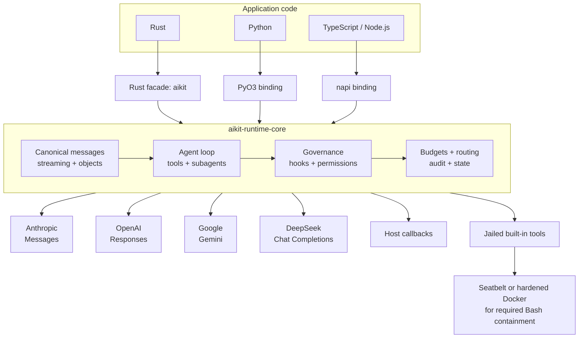
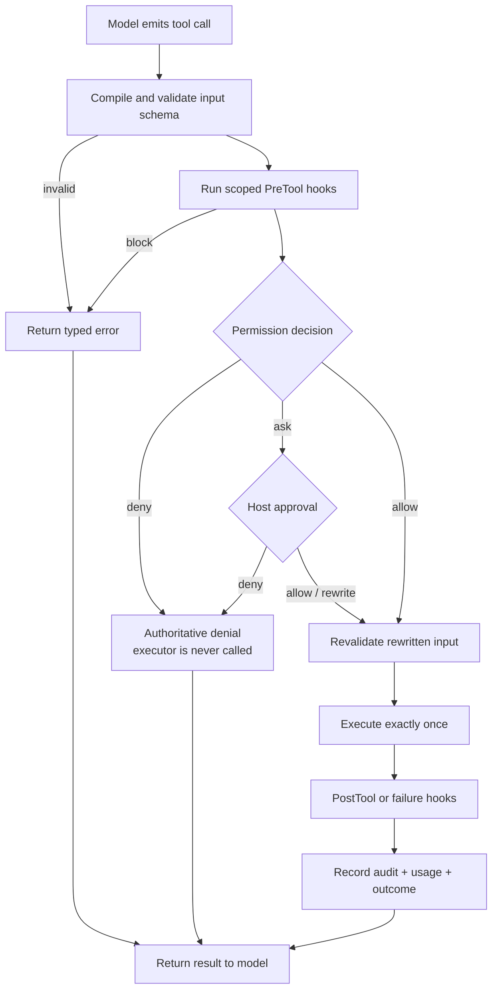

<!-- markdownlint-disable MD013 MD033 MD041 -->

<div align="center">

# aikit-runtime

<p><strong>One governed runtime for serious AI agents.</strong></p>

Build provider-aware agents in **Rust**, **Python**, and **TypeScript** without reimplementing
streaming, tools, policy, routing, budgets, audit, memory, or sessions in every language.

[](https://github.com/matakartal/aikit-runtime/actions/workflows/ci.yml)
[](https://github.com/matakartal/aikit-runtime/actions/workflows/release.yml)
[](Cargo.toml)
[](crates/aikit-py/pyproject.toml)
[](crates/aikit-node/package.json)
[](#license)

**One core. Three SDKs. Four native providers. One policy boundary.**

[Quick start](#quick-start) · [Architecture](#architecture) · [Governance](#governed-tool-execution) · [SDKs](#one-runtime-three-sdks) · [Documentation](#documentation)

</div>

---

`aikit-runtime` keeps correctness-sensitive agent behavior in one Rust core and exposes it through
thin native bindings. Anthropic, OpenAI, Google, and DeepSeek retain their native wire formats,
while your application gets one canonical runtime contract.

## Why aikit?

| One runtime | Provider-native | Governed execution |
|---|---|---|
| Rust owns the agent loop; Python and Node call the same implementation. | Provider-specific reasoning, tool calls, citations, usage, and metadata stay intact. | Every side effect passes schema validation, hooks, permissions, budgets, and audit. |
| **Typed developer experience** | **Agent primitives included** | **Production controls built in** |
| Streaming text, structured objects, multimodal messages, typed errors, and cancellation. | Tools, subagents, parallel fan-out, councils, memory, sessions, routing, and retries. | Fail-closed containment, metadata-safe audit, cost limits, scoped tools, and explicit approvals. |

## Architecture



The bindings translate host values and async callbacks at the edge. They do not duplicate policy,
provider translation, or orchestration logic.

## Quick start

The repository includes a deterministic provider, so you can exercise the complete runtime with
**no API key and no network call**.

```bash
git clone https://github.com/matakartal/aikit-runtime.git
cd aikit-runtime
cargo run -p aikit-runtime --example quickstart
```

Expected output:

```text
Araç sonucunu aldım; görevi tamamladım.
```

### Rust

```rust
use aikit::Agent;

#[tokio::main]
async fn main() -> Result<(), Box<dyn std::error::Error>> {
    let answer = Agent::new()
        .generate_text("Say hello in Turkish", "mock-1", 128)
        .await?;

    println!("{}", answer.text);
    Ok(())
}
```

Run it from this checkout:

```bash
cargo run -p aikit-runtime --example quickstart
```

### Python

Build the native binding once, then use the same core from Python:

```bash
python3 -m venv .venv
.venv/bin/pip install "maturin>=1.5,<2"
.venv/bin/maturin develop --manifest-path crates/aikit-py/Cargo.toml
```

```python
import asyncio
import aikit

async def main() -> None:
    agent = aikit.Agent.from_env({})
    answer = await agent.generate_text("Say hello in Turkish")
    print(answer["text"])

asyncio.run(main())
```

### TypeScript / Node.js

```bash
./scripts/build-node.sh
```

```js
const { Agent } = require("./crates/aikit-node");

async function main() {
  const agent = Agent.fromEnv({});
  const answer = await agent.generateText("Say hello in Turkish");
  console.log(answer.text);
}

main();
```

## Built for agent workloads

| Capability | What aikit provides |
|---|---|
| Streaming | Incremental text, reasoning, tool-call, tool-result, usage, and terminal events. |
| Structured output | JSON Schema validation, bounded repair, streaming attempts, Pydantic and Zod materialization. |
| Canonical messages | Text, reasoning, tools, media, citations, usage, and provider-owned metadata without flattening. |
| Governance | Global allow / ask / deny rules, async approval, lifecycle hooks, input rewrites, and authoritative denial. |
| Guardrails | Deterministic secret/PII redaction, regex blocking, and fail-closed MCP safety-server interop. |
| Self-extension | Human-governed capability requests: the agent asks for a tool it lacks, a human decides, the grant is recorded — never a silent escalation. |
| Tool runtime | Host callbacks plus opt-in Read, Write, Edit, Glob, Grep, and contained Bash. |
| MCP | Stdio and Streamable HTTP client with tools, resources, prompts, auth/session propagation, and governed execution. |
| Routing | Explicit or automatic model selection from a caller-owned catalog with hard capability and cost gates. |
| Resilience | Typed failures, bounded retry, pre-stream fallback, cancellation, deadlines, and terminal outcomes. |
| Orchestration | Scoped subagents, ordered parallel fan-out, council synthesis, quorum, and shared budget accounting. |
| State | Namespaced memory, revisioned sessions, JSON/transactional SQLite persistence, canonical recording, and resume. |
| Compaction | Opt-in transcript bounding: keep the task anchor and recent tail within a token budget, preserving tool pairing. |
| Web and browser | HTTPS allowlisted fetch/search plus an existing-session WebDriver executor; both use the shared governed tool boundary. |
| Observability | Typed audit lifecycle, metadata-only redaction by default, JSONL sinks, and an optional Rust OpenTelemetry bridge. |

## Governed tool execution

Tool authorization happens immediately before the side effect—not in a prompt and not in a UI
convention.



A denied tool never reaches its callback. Approval and hook rewrites are schema-validated again
before execution.

### Example: policy around a host tool

```python
agent = aikit.Agent.from_env({})

async def lookup(payload: dict) -> str:
    return f"price:{payload['symbol']}"

agent.add_tool(
    "lookup",
    "Look up one market symbol",
    {
        "type": "object",
        "properties": {"symbol": {"type": "string"}},
        "required": ["symbol"],
        "additionalProperties": False,
    },
    lookup,
)

agent.set_permissions([
    {"id": "approve-lookups", "effect": "ask", "tool": "lookup"},
])

async def approve(request: dict):
    return "allow" if request["input"]["symbol"] == "AAPL" else "deny"

agent.can_use_tool(approve)
```

The same lifecycle exists in Rust and TypeScript; only the host callback syntax changes.

## Provider fidelity

`aikit` uses native adapters rather than forcing every provider through one lossy compatibility
shape.

| Provider | Native API | Reasoning continuation | Structured output | Vision |
|---|---|---|---|---:|
| Anthropic | Messages | Signed thinking replayed unchanged | Native JSON Schema constraint | Yes |
| OpenAI | Responses | Opaque reasoning item replayed unchanged | Strict JSON Schema | Yes |
| Google | Gemini `generateContent` | Thought signature retained on the exact function-call part | `responseJsonSchema` | Yes |
| DeepSeek | Chat Completions | Full `reasoning_content` retained for tool continuation | JSON mode + validation and repair | No |

Generated objects report their actual fidelity:

- `native_constrained`
- `forced_tool_call`
- `prompted_and_parsed`

Your application can branch on that grade instead of assuming every JSON-shaped answer has the
same guarantee.

## One runtime, three SDKs

| Concept | Rust | Python | TypeScript |
|---|---|---|---|
| Agent | `Agent::new()` | `aikit.Agent()` | `new Agent()` |
| Text | `generate_text` | `generate_text` | `generateText` |
| Streaming | `stream_text` | `stream_text` | `streamText` |
| Structured output | `generate_object` | `generate_object` | `generateObject` |
| Tool registration | `tool` / executor | `add_tool` | `addTool` |
| Permissions | `Governance` | `set_permissions` | `setPermissions` |
| Memory | `remember` / `recall` | `remember` / `recall` | `remember` / `recall` |
| Parallel agents | `parallel` | `parallel` | `parallel` |
| Persistent audit | `JsonlAuditSink` | `configure_jsonl_audit` | `configureJsonlAudit` |

Cross-language conformance runs canonical scenarios through all three SDKs and compares normalized
results byte for byte.

## Multimodal and structured input

All text and object surfaces accept a string or canonical message history:

```python
messages = [{
    "role": "user",
    "content": [
        {"type": "text", "text": "Describe this chart"},
        {
            "type": "media",
            "media_type": "image/png",
            "source": {"kind": "url", "url": "https://example.com/chart.png"},
        },
    ],
}]

result = await agent.generate_text(messages, model="your-model")
```

Unsupported media is rejected with a typed error instead of being silently dropped.

## Tools and containment

Built-in tools are explicit and scoped:

```python
agent.register_builtin_tools(["./workspace"])
agent.configure_jsonl_audit("./state/audit.jsonl")
agent.use_memory_file("./state/memory.json", namespace="project-a")
agent.use_session_file("./state/sessions.json")
```

| Surface | Boundary |
|---|---|
| Read / Write / Edit / Glob / Grep | Descriptor-relative jail, registered roots only, no symlink following. |
| Built-in Bash | Required containment: probed macOS Seatbelt or hardened, digest-pinned Docker. |
| Host callbacks | Your application process and your responsibility to isolate further when needed. |

If required containment is unavailable, built-in Bash is denied before process launch.

## Package map

The coordinated release name is `aikit-runtime`; the bare `aikit` names on public registries refer
to unrelated projects.

| Ecosystem | Distribution | Import / library |
|---|---|---|
| Rust facade | `aikit-runtime` | `aikit` |
| Rust core | `aikit-runtime-core` | `aikit_core` |
| Python | `aikit-runtime` | `import aikit` |
| npm wrapper | `aikit-runtime` | `require("aikit-runtime")` |
| npm native binaries | `aikit-runtime-{platform}` | selected automatically by the wrapper |

The current `v0.1.0` release candidate is built and verified from source. Registry publication is
the final distribution step; until then, use the checkout commands in [Quick start](#quick-start).

### Supported binary targets

| Platform | Python ABI3 wheel | Node native package |
|---|---:|---:|
| Linux x64 glibc | Yes | Yes |
| Linux ARM64 glibc | Yes | Yes |
| macOS ARM64 | Yes | Yes |
| macOS x64 | Yes | Yes |
| Windows x64 | Yes | Yes |

## Verification

```bash
cargo fmt --all --check
cargo clippy --workspace --all-targets --all-features --locked -- -D warnings
cargo test --workspace --all-features --locked
./scripts/parity-check.sh
./scripts/release-check.sh --candidate
```

The GitHub matrix also verifies:

- Rust stable, Rust 1.88 MSRV, rustdoc, and doctests
- Rust / Python / Node canonical parity
- Python ABI3 wheels on five target combinations
- Node native packages on five target combinations
- packaged install and native-addon loading
- artifact SHA-256 manifests and GitHub provenance attestations
- keyless provider wire contracts and fail-closed containment behavior

## Repository map

```text
.
├── crates/
│   ├── aikit/          # ergonomic Rust facade
│   ├── aikit-core/     # canonical runtime and provider adapters
│   ├── aikit-py/       # PyO3 binding + type declarations
│   └── aikit-node/     # napi binding + TypeScript declarations
├── examples/
│   ├── python/         # governance, options, and conformance
│   └── node/           # governance, options, and conformance
├── docs/               # features, threat model, release, and design notes
└── scripts/            # build, parity, packaging, and release gates
```

## Documentation

| Guide | Purpose |
|---|---|
| [Feature reference](docs/FEATURES.md) | Runtime capabilities, fidelity, routing, orchestration, state, and limits. |
| [Threat model](docs/THREAT-MODEL.md) | Security guarantees, containment boundaries, and exclusions. |
| [Release guide](docs/RELEASE.md) | Package identities, publication order, and release gates. |
| [Live-provider harness](docs/LIVE-SMOKE.md) | Optional real-provider acceptance test contract. |
| [Completion matrix](docs/V1-COMPLETION-MATRIX.md) | Detailed v1 implementation coverage. |
| [Documentation index](docs/README.md) | Every design and historical document in one place. |

## Contributing

Contributions are welcome. Start with [CONTRIBUTING.md](CONTRIBUTING.md), follow the
[Code of Conduct](CODE_OF_CONDUCT.md), and report vulnerabilities through the private process in
[SECURITY.md](SECURITY.md).

## License

Licensed under either of the following, at your option:

- [Apache License, Version 2.0](LICENSE-APACHE)
- [MIT License](LICENSE-MIT)
