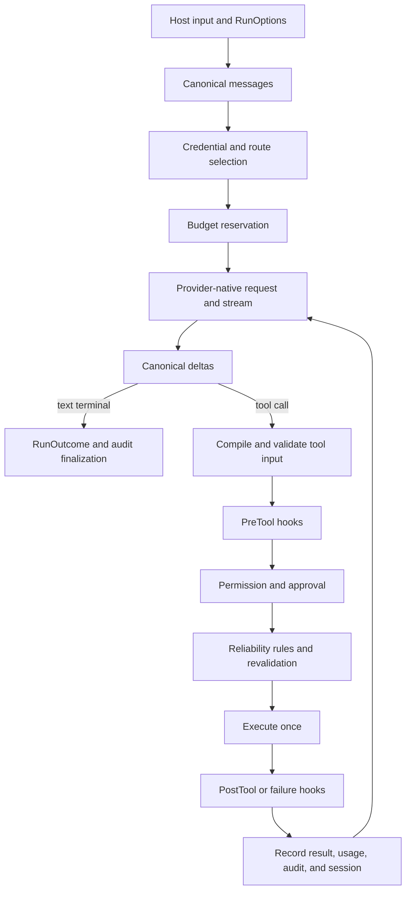

# Architecture

This document explains where behavior lives, how one request moves through the runtime, and which
boundaries remain the embedding application's responsibility. It describes the source-first
`v0.3.0-alpha.1` tree; the code and tests remain authoritative when this document drifts.

## Design goals

1. **One correctness core.** Provider translation, the agent loop, governance, budgets, state, and
   evaluation live in Rust once.
2. **Thin language edges.** Python and Node translate host values and async callbacks; they do not
   reimplement enforcement decisions.
3. **Provider-native fidelity.** Opaque reasoning, signatures, citations, usage, and metadata keep
   their provider ownership instead of being flattened into a lowest-common-denominator message.
4. **Governance before effects.** Schemas, hooks, permissions, approvals, reliability rules, and
   budgets run before a tool callback or built-in side effect.
5. **Fail closed at ambiguous boundaries.** Unknown fields, malformed provider streams, unbounded
   MCP discovery, unsafe filesystem entries, stale execution claims, and unsupported containment
   are errors rather than implicit permission.

## Workspace ownership

| Path | Owns |
|---|---|
| `crates/aikit-core` | Canonical types, providers, runtime loop, governance, tools, routing, state, audit, structured output, MCP, and eval. |
| `crates/aikit` | Ergonomic Rust facade and public re-exports. |
| `crates/aikit-py` | PyO3 conversion, Python async streams/callbacks, and type stubs. |
| `crates/aikit-node` | napi conversion, JavaScript lifecycle helpers, and TypeScript declarations. |
| `crates/aikit-cli` | Source-first `aikit` binary using the Rust facade. |
| `examples/` | Runnable cross-language examples and parity scenarios. |
| `evals/` | Versioned deterministic evaluation datasets. |
| `scripts/` | Binding builds, parity, live-provider, package-layout, and release-candidate checks. |

## Request lifecycle

Cancellation and typed failure paths converge on finalization: Stop hooks, budget reconciliation,
audit policy, execution-lease release, and terminal outcome recording are part of the lifecycle,
not optional cleanup performed only after success.

## Canonical data model

`Message` and `ContentBlock` preserve text, reasoning, tool calls/results, media, citations, and
provider-owned opaque metadata. `RunOutcome` contains the canonical transcript, terminal status,
usage, final-text convenience projection, provider metadata, model-attempt history, and the
`invocation_start_message_index` boundary used by current-run evaluations.

Provider-owned reasoning may be replayed only to the same provider family. A fallback cannot send
an Anthropic signature, OpenAI reasoning item, Gemini thought signature, or DeepSeek reasoning
content across provider boundaries.

## Provider layer

AIKit exposes eight named, separately authenticated adapters. Four vendor-native adapters keep
distinct request/stream contracts:

| Provider | Native surface | Continuation state |
|---|---|---|
| Anthropic | Messages | Signed thinking blocks. |
| OpenAI | Responses | Opaque reasoning items and function-call ids. |
| Google | Gemini `generateContent` | Thought signatures on their original parts. |
| DeepSeek | Chat Completions | Conditional `reasoning_content` replay for tool continuation. |

OpenRouter, Groq, Mistral, and xAI are first-class isolated OpenAI-compatible adapters rather than a
caller-supplied base URL. They receive explicit credential, endpoint, model, stream, tool, error,
usage, and metadata handling, but do not inherit native-provider fidelity claims automatically.

Before network I/O, the selected adapter validates provider parameters against its shipped
catalog. Strict mode fails on unknown parameters. Warn/best-effort modes preserve the original
value and emit a typed compatibility warning; neither mode silently removes a field. Strict media
uses the same fail-closed boundary: inline bytes are hash/size verified, while URL/artifact inputs
must first be resolved to verified bytes by host-governed egress or artifact storage.

## Governance and tool execution

The enforcement order is intentionally layered:

1. advertised-tool and JSON-Schema validation;
2. input guardrails and scoped PreTool hooks;
3. authoritative deny/ask/allow policy and optional human approval;
4. revalidation after every approved rewrite;
5. reliability prerequisites and usage caps;
6. exactly one executor call;
7. PostTool or PostToolFailure hooks, output guardrails, audit, and transcript recording.

An earlier allow never overrides a matching deny. Child agents inherit and may narrow the parent
boundary; they cannot broaden tools, permissions, deadlines, or the shared budget.

## Structured output and evaluation

Structured generation chooses the strongest provider-supported mechanism and reports its actual
`FidelityGrade`. JSON parsing and JSON-Schema validation run before the optional async semantic
validator. Semantic `Retry` consumes the same bounded repair budget; `Reject`, callback errors,
and panics fail closed. Validators are host code and must be pure/idempotent.

The eval engine is separate from generation. It consumes a completed canonical `RunOutcome` and
deterministic gates; it never calls a judge model. Message-derived gates inspect only content after
the recorded invocation boundary, preventing resumed conversation history from producing a false
pass.

## MCP boundary

Each MCP connection owns its transport, initialization/session state, discovery cache, and exact
tool filter. The client bounds response bytes before JSON decoding and bounds pages, total items,
serialized discovery bytes, cursor sizes, and repeated cursors. Tool allow/deny filtering runs
before cache retention and again at execution, so a hidden or newly denied tool cannot be called
through a stale advertised list.

MCP tool execution still flows through normal aikit governance. A remote server is not trusted
because it speaks MCP, and MCP transport limits are not a substitute for application-level tool
permissions.

The inbound MCP server persists Tasks, request receipts, schema identity, HTTP sessions, and SSE
replay state behind store compare-and-swap. Duplicate request ids join or replay the same receipt.
Retention and TTL bounds prevent protocol state from becoming an unbounded durable queue. A host
cancellation must be confirmed before a task becomes cancelled; timeout or ambiguous teardown
moves the task to a fail-closed reconciliation state. After schema drift is approved, arguments
are validated against the new schema before dispatch.

## State and crash safety

- Memory is explicit: model output is not remembered unless the host calls `remember`.
- JSON stores provide durable local files with owner-only permissions where supported, but their
  coordination is process-local.
- SQLite stores provide transactional cross-process compare-and-swap behavior.
- The optional PostgreSQL durable store uses a row lock plus revision CAS and verifies that every
  replacement is an append-only extension. Live database/failover proof is a separate gate.
- Session execution leases prevent concurrent work. Lease expiry does not prove the previous
  owner failed before an external effect, so normal execution never auto-takes an expired lease.
- Recovery is an explicit operator action after the old worker is stopped and external effects are
  reconciled. Random fencing tokens prevent same-owner ABA during commit/release.

Durable runs use an append-only event log with checkpoint projections. Resume and fork preserve
activity identity; rewind appends a reverse event instead of deleting history. Activities are
classified as pure, idempotent, or reconciliation-required, so an ambiguous external effect stops
for operator reconciliation instead of being presented as exactly-once execution.
The Temporal adapter is a deterministic SDK-neutral mapping layer; a host still owns the actual
Temporal worker, history transport, and deployment compatibility.

Governed durable runs event-source a sealed binding over policy snapshot hash, tenant, agent, and
run id. Approval evidence contains the same binding. Reattachment after restart and every tool
authorization revalidate it, so changing context or replacing a snapshot cannot reuse an earlier
approval.

## Containment and trust boundaries

Built-in file tools use descriptor-relative jailed access on Linux/macOS and fail closed on
unsupported platforms. Built-in Bash requires a probed containment backend: Seatbelt, Linux
namespaces+seccomp, Windows Job Objects, or digest-pinned hardened Docker. These backends make
different guarantees; consult the [threat model](THREAT-MODEL.md).

The optional Firecracker lifecycle additionally pins kernel/rootfs/VMM/jailer hashes, validates
trusted ownership and Linux prerequisites, configures the API in bounded steps, and supervises the
child together with its jail staging. Cleanup waits for child exit before removing the jail; an
irrecoverable reap failure leaks the staging directory instead of risking path reuse under a live
VMM. It is not a Bash backend until guest command/workspace transport and Linux root+KVM tests
exist.

Rust executors, Python/Node callbacks, semantic validators, external MCP servers, and WebDriver
browsers remain host/application trust boundaries. The explicit `EgressBroker` validates method,
scheme, domain, port, each redirect, and freshly resolved public IPs before pinned HTTP connects;
an exact HTTPS policy can produce the assertion required by browser registration. Arbitrary child
processes and external WebDriver deployments must still be routed through an enforcing proxy by
the host.

## Cross-language contract

Public behavior is added to the Rust core first, then projected through PyO3/napi with strict
unknown-field rejection and typed stubs/declarations. `scripts/parity-check.sh` compares seven
canonical modules and their observable transcripts across Rust, Python, and Node. Language-specific
conveniences may differ, but enforcement and canonical outcomes must not.

## Verification layers

| Layer | Primary proof |
|---|---|
| Formatting and lint | rustfmt and Clippy with `-D warnings`. |
| Runtime correctness | Full workspace tests and local real-socket provider fixtures. |
| Compatibility | Rust 1.88 MSRV check, Python mypy strict, TypeScript strict. |
| Cross-language behavior | `scripts/parity-check.sh`. |
| Deterministic quality | `aikit eval evals/smoke.json`. |
| Distribution | `scripts/release-check.sh --candidate` and manual artifact workflow. |
| External providers | Explicit, billable live-smoke workflow only. |

See [FEATURES.md](FEATURES.md) for the capability reference and
[PROJECT-STATUS.md](PROJECT-STATUS.md) for the current proof boundary.
