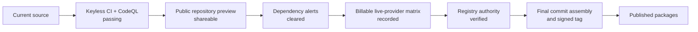

# Project status

**Snapshot date:** 2026-07-16  
**Release state:** unpublished `v0.1.0` implementation candidate

This page separates what can be demonstrated from source today from the external work required
before package publication.

## Ready today

- The Rust core and Rust, Python, and TypeScript/Node surfaces are implemented.
- Native Anthropic, OpenAI, Google, and DeepSeek adapters are covered by keyless wire-contract
  tests; OpenRouter, Groq, Mistral, and xAI use isolated compatible endpoints.
- Governance, tools, routing, budgets, sessions, memory, containment, audit, and orchestration are
  exercised without API keys through the deterministic mock provider.
- Main-branch CI and CodeQL are green for the current source tree.
- The repository is suitable to share publicly as an open-source implementation preview.

## Not claimed yet

- No package is published to crates.io, PyPI, or npm.
- No paid live-provider acceptance result is claimed for the current candidate.
- The existing `v0.1.0` artifact evidence records an older draft source snapshot, not current
  `main`; release assembly must be rerun for the final tag commit.
- Dependency-security clearance is still a release gate. The current PyO3 line has upstream
  advisories with fixes in a newer line and must be upgraded and reverified before publication.

## Release decision

The repository can be announced now as open source. It should not be described as a published,
production-ready package until every gate after `shareable` is completed and recorded in a fresh
release-evidence file.

See the [release guide](RELEASE.md), [completion matrix](V1-COMPLETION-MATRIX.md), and
[live-provider contract](LIVE-SMOKE.md) for the detailed checks.
