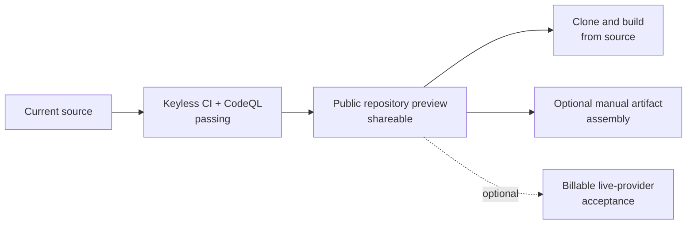

# Project status

**Snapshot date:** 2026-07-16  
**Release state:** source-first `v0.1.0` open-source preview

This page records what can be demonstrated from source today.

## Ready today

- The Rust core and Rust, Python, and TypeScript/Node surfaces are implemented.
- Native Anthropic, OpenAI, Google, and DeepSeek adapters are covered by keyless wire-contract
  tests; OpenRouter, Groq, Mistral, and xAI use isolated compatible endpoints.
- Governance, tools, routing, budgets, sessions, memory, containment, audit, and orchestration are
  exercised without API keys through the deterministic mock provider.
- Main-branch CI and CodeQL are green for the current source tree.
- The repository is suitable to share publicly as an open-source implementation preview.
- The source-first CLI provides keyless runs, interactive chat, provider/capability discovery,
  containment diagnostics, automation output, and shell completions.

## Distribution boundaries

- Public registry packages are intentionally not distributed. GitHub source is the official path.
- No paid live-provider acceptance result is claimed for the current candidate.
- The existing `v0.1.0` evidence is a historical artifact snapshot, not a registry-release record.
- The Python FFI stack uses patched PyO3 0.29 and the repository lockfile passes `cargo audit`.

## Release decision

The repository can be announced and used from source now. It should not be described as available
through npm, PyPI, or crates.io.

See the [release guide](RELEASE.md), [completion matrix](V1-COMPLETION-MATRIX.md), and
[live-provider contract](LIVE-SMOKE.md) for the detailed checks.
